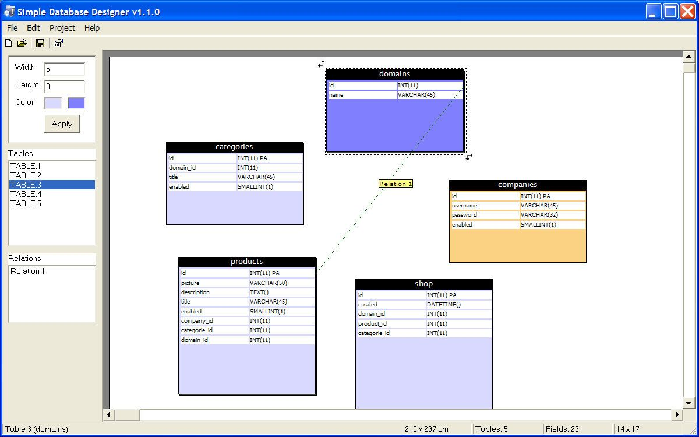



## Simple Database Designer 1\.1\.0

### Description

Simple Database Designer is an application witch you can use to create your one database models. You can create tables, fields and relations. You can export your database structure directly to a SQL script and you can export your database model to a Bitmap, JPG or GIF image file. You can move the tables with the drag and drop method. You can change the properties of the workspace (size, background color). You can delete tables, fields and relations. All relations witch are connected with a table you are going to remove will be automatic detected and removed. You can reorder the tables (foreground or background).
 
### More Info
 
If you create a Setup file some components are required to be installed and registered onto the users system (but you probably know this already. This application uses two special components for the JPG and GIF drawing export. The rest of the components are installed inside you Windows System32 directory.

             |
---                |---
**Submitted On**   |2006-01-30 16:30:00
**By**             |[Jasper van Gent](https://github.com/Planet-Source-Code/PSCIndex/blob/master/ByAuthor/jasper-van-gent.md)
**Level**          |Intermediate
**User Rating**    |5.0 (15 globes from 3 users)
**Compatibility**  |VB 6\.0
**Category**       |[Complete Applications](https://github.com/Planet-Source-Code/PSCIndex/blob/master/ByCategory/complete-applications__1-27.md)
**World**          |[Visual Basic](https://github.com/Planet-Source-Code/PSCIndex/blob/master/ByWorld/visual-basic.md)
**Archive File**   |[Simple\_Dat196943222006\.zip](https://github.com/Planet-Source-Code/jasper-van-gent-simple-database-designer-1-1-0__1-64201/archive/master.zip)

